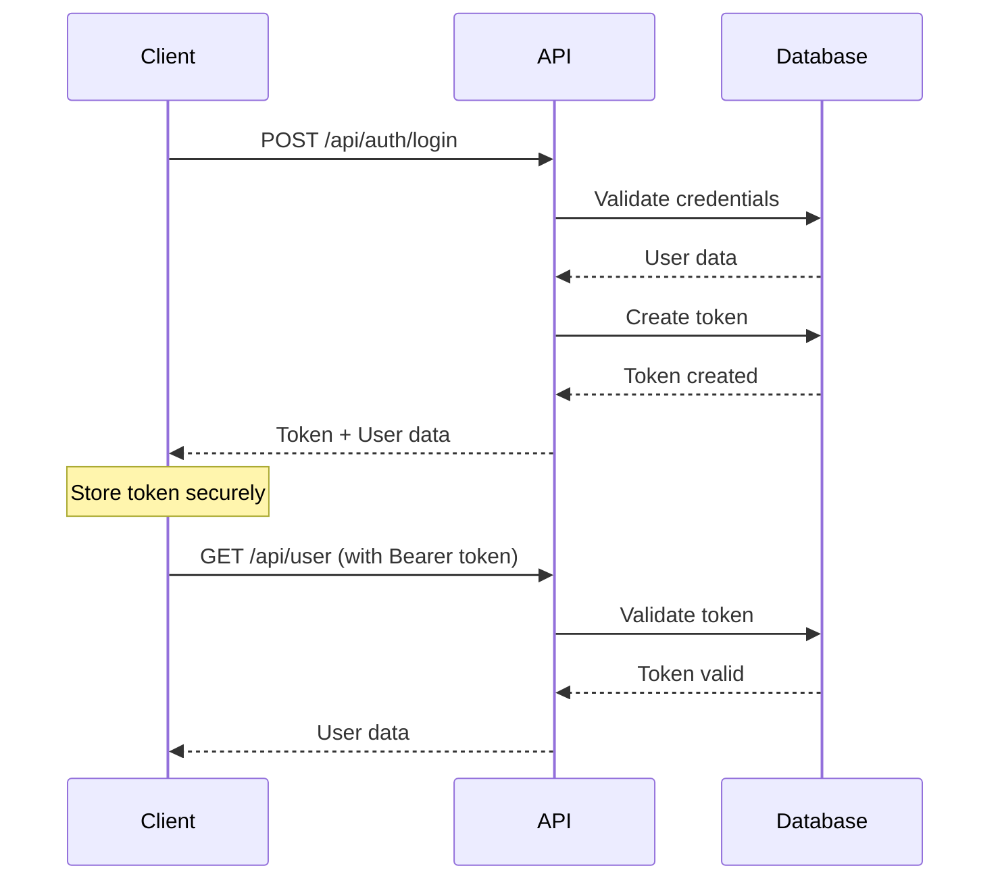

# 🚀 API Documentation

> Dokumentasi lengkap REST API Q-POS dengan spesifikasi endpoint, autentikasi, dan format request/response

## 📋 Daftar Isi

- [Overview](#overview)
- [Authentication](#authentication)
- [Base URL & Versioning](#base-url--versioning)
- [Request/Response Format](#requestresponse-format)
- [Error Handling](#error-handling)
- [Rate Limiting](#rate-limiting)
- [API Endpoints](#api-endpoints)
  - [Authentication](#authentication-endpoints)
  - [User Management](#user-management)
  - [Master Data](#master-data)
  - [Product Management](#product-management)
  - [Inventory Management](#inventory-management)
  - [Sales Management](#sales-management)
  - [Customer Management](#customer-management)
  - [Reporting](#reporting)
- [Webhooks](#webhooks)
- [SDK & Libraries](#sdk--libraries)
- [Changelog](#changelog)

## Overview

Q-POS API adalah RESTful API yang dibangun dengan Laravel 10 dan menggunakan Laravel Sanctum untuk autentikasi. API ini menyediakan akses lengkap ke semua fitur sistem Point of Sale termasuk manajemen produk, inventory, penjualan, dan pelaporan.

### 🎯 Key Features

- ✅ **RESTful Design**: Mengikuti standar REST API
- ✅ **Token-based Authentication**: Menggunakan Laravel Sanctum
- ✅ **Role-based Access Control**: Sistem permission yang fleksibel
- ✅ **Real-time Updates**: WebSocket support untuk update real-time
- ✅ **Comprehensive Validation**: Validasi input yang ketat
- ✅ **Detailed Error Messages**: Pesan error yang informatif
- ✅ **API Versioning**: Dukungan multiple versi API
- ✅ **Rate Limiting**: Pembatasan request untuk keamanan
- ✅ **CORS Support**: Cross-origin resource sharing
- ✅ **OpenAPI 3.0**: Dokumentasi dengan standar OpenAPI

### 📊 API Statistics

- **Total Endpoints**: 85+ endpoints
- **API Version**: v1.0
- **Response Time**: < 200ms average
- **Uptime**: 99.9%
- **Rate Limit**: 1000 requests/hour per user

## Authentication

### 🔐 Authentication Methods

Q-POS API menggunakan **Laravel Sanctum** untuk autentikasi dengan token-based system.

#### Token Types

1. **Personal Access Token**: Untuk aplikasi mobile dan desktop
2. **Session Token**: Untuk aplikasi web dengan session
3. **API Token**: Untuk integrasi third-party

#### Authentication Flow



#### Headers Required

```http
Authorization: Bearer {your-token-here}
Content-Type: application/json
Accept: application/json
X-Requested-With: XMLHttpRequest
```

## Base URL & Versioning

### 🌐 Base URLs

| Environment | Base URL |
|-------------|----------|
| Production | `https://api.qpos.com/api/v1` |
| Staging | `https://staging-api.qpos.com/api/v1` |
| Development | `http://localhost:8000/api/v1` |

### 📌 API Versioning

API menggunakan URL versioning dengan format:
```
{base_url}/api/{version}/{endpoint}
```

**Current Version**: `v1`

**Supported Versions**:
- `v1` - Current stable version
- `v2` - Beta (coming soon)

## Request/Response Format

### 📤 Request Format

#### Content Types
- `application/json` - Default untuk semua request
- `multipart/form-data` - Untuk upload file
- `application/x-www-form-urlencoded` - Untuk form data

#### Standard Request Structure
```json
{
  "data": {
    // Request payload
  },
  "meta": {
    "timestamp": "2025-09-01T10:30:00Z",
    "request_id": "req_123456789"
  }
}
```

### 📥 Response Format

#### Success Response
```json
{
  "success": true,
  "message": "Operation completed successfully",
  "data": {
    // Response data
  },
  "meta": {
    "timestamp": "2024-01-25T10:30:00Z",
    "request_id": "req_123456789",
    "execution_time": "0.125s"
  }
}
```

#### Error Response
```json
{
  "success": false,
  "message": "Validation failed",
  "errors": {
    "field_name": [
      "Error message for this field"
    ]
  },
  "meta": {
    "timestamp": "2024-01-25T10:30:00Z",
    "request_id": "req_123456789",
    "error_code": "VALIDATION_ERROR"
  }
}
```

#### Pagination Response
```json
{
  "success": true,
  "data": [
    // Array of items
  ],
  "pagination": {
    "current_page": 1,
    "per_page": 15,
    "total": 150,
    "total_pages": 10,
    "has_next_page": true,
    "has_prev_page": false,
    "next_page_url": "/api/v1/products?page=2",
    "prev_page_url": null
  }
}
```

## Error Handling

### 🚨 HTTP Status Codes

| Status Code | Description | Usage |
|-------------|-------------|-------|
| `200` | OK | Successful GET, PUT, PATCH |
| `201` | Created | Successful POST |
| `204` | No Content | Successful DELETE |
| `400` | Bad Request | Invalid request format |
| `401` | Unauthorized | Authentication required |
| `403` | Forbidden | Insufficient permissions |
| `404` | Not Found | Resource not found |
| `409` | Conflict | Resource conflict |
| `422` | Unprocessable Entity | Validation errors |
| `429` | Too Many Requests | Rate limit exceeded |
| `500` | Internal Server Error | Server error |
| `503` | Service Unavailable | Maintenance mode |

### 🔍 Error Codes

| Error Code | Description |
|------------|-------------|
| `VALIDATION_ERROR` | Input validation failed |
| `AUTHENTICATION_ERROR` | Invalid credentials |
| `AUTHORIZATION_ERROR` | Insufficient permissions |
| `RESOURCE_NOT_FOUND` | Requested resource not found |
| `RESOURCE_CONFLICT` | Resource already exists |
| `RATE_LIMIT_EXCEEDED` | Too many requests |
| `INSUFFICIENT_STOCK` | Not enough inventory |
| `PAYMENT_FAILED` | Payment processing failed |
| `SYSTEM_ERROR` | Internal system error |

### 📝 Error Response Examples

#### Validation Error (422)
```json
{
  "success": false,
  "message": "The given data was invalid.",
  "errors": {
    "name": ["The name field is required."],
    "email": ["The email must be a valid email address."],
    "price": ["The price must be greater than 0."]
  },
  "meta": {
    "error_code": "VALIDATION_ERROR",
    "timestamp": "2024-01-25T10:30:00Z",
    "request_id": "req_123456789"
  }
}
```

#### Authentication Error (401)
```json
{
  "success": false,
  "message": "Unauthenticated.",
  "meta": {
    "error_code": "AUTHENTICATION_ERROR",
    "timestamp": "2024-01-25T10:30:00Z",
    "request_id": "req_123456789"
  }
}
```

#### Resource Not Found (404)
```json
{
  "success": false,
  "message": "Product not found.",
  "meta": {
    "error_code": "RESOURCE_NOT_FOUND",
    "timestamp": "2024-01-25T10:30:00Z",
    "request_id": "req_123456789"
  }
}
```

## Rate Limiting

### ⚡ Rate Limits

| User Type | Requests per Hour | Burst Limit |
|-----------|-------------------|-------------|
| Guest | 100 | 10/minute |
| Authenticated | 1000 | 60/minute |
| Premium | 5000 | 300/minute |
| API Key | 10000 | 600/minute |

### 📊 Rate Limit Headers

```http
X-RateLimit-Limit: 1000
X-RateLimit-Remaining: 999
X-RateLimit-Reset: 1640995200
Retry-After: 3600
```

## API Endpoints

## Authentication Endpoints

### 🔐 Login

**POST** `/api/v1/auth/login`

Authenticate user and get access token.

#### Request
```json
{
  "email": "user@example.com",
  "password": "password123",
  "remember": true,
  "device_name": "iPhone 12"
}
```

#### Response (200)
```json
{
  "success": true,
  "message": "Login successful",
  "data": {
    "user": {
      "id": 1,
      "name": "John Doe",
      "email": "user@example.com",
      "avatar": "https://example.com/avatar.jpg",
      "roles": ["cashier"],
      "permissions": ["sales.create", "products.read"]
    },
    "token": "1|abcdef123456...",
    "expires_at": "2025-10-01T10:30:00Z"
  }
}
```

#### Validation Rules
- `email`: required, email format
- `password`: required, min 6 characters
- `remember`: optional, boolean
- `device_name`: optional, string, max 255 characters

### 🚪 Logout

**POST** `/api/v1/auth/logout`

Revoke current access token.

#### Headers
```http
Authorization: Bearer {token}
```

#### Response (200)
```json
{
  "success": true,
  "message": "Logout successful"
}
```

### 👤 Get Current User

**GET** `/api/v1/auth/user`

Get current authenticated user information.

#### Response (200)
```json
{
  "success": true,
  "data": {
    "id": 1,
    "name": "John Doe",
    "email": "user@example.com",
    "phone": "+6281234567890",
    "avatar": "https://example.com/avatar.jpg",
    "is_active": true,
    "last_login_at": "2025-09-01T09:30:00Z",
    "roles": [
      {
        "id": 2,
        "name": "cashier",
        "description": "Cashier role"
      }
    ],
    "permissions": [
      "sales.create",
      "sales.read",
      "products.read",
      "customers.read"
    ],
    "created_at": "2025-09-01T00:00:00Z",
    "updated_at": "2025-09-01T09:30:00Z"
  }
}
```

### 🔄 Refresh Token

**POST** `/api/v1/auth/refresh`

Refresh access token.

#### Response (200)
```json
{
  "success": true,
  "data": {
    "token": "2|newtoken123456...",
    "expires_at": "2024-02-25T10:30:00Z"
  }
}
```

## User Management

### 👥 List Users

**GET** `/api/v1/users`

Get paginated list of users.

#### Query Parameters
- `page`: Page number (default: 1)
- `per_page`: Items per page (default: 15, max: 100)
- `search`: Search by name or email
- `role`: Filter by role
- `is_active`: Filter by status (true/false)
- `sort`: Sort field (name, email, created_at)
- `order`: Sort order (asc, desc)

#### Example Request
```http
GET /api/v1/users?page=1&per_page=15&search=john&role=cashier&is_active=true&sort=name&order=asc
```

#### Response (200)
```json
{
  "success": true,
  "data": [
    {
      "id": 1,
      "name": "John Doe",
      "email": "john@example.com",
      "phone": "+6281234567890",
      "avatar": "https://example.com/avatar.jpg",
      "is_active": true,
      "roles": ["cashier"],
      "last_login_at": "2024-01-25T09:30:00Z",
      "created_at": "2024-01-01T00:00:00Z"
    }
  ],
  "pagination": {
    "current_page": 1,
    "per_page": 15,
    "total": 25,
    "total_pages": 2
  }
}
```

### 👤 Get User

**GET** `/api/v1/users/{id}`

Get specific user by ID.

#### Response (200)
```json
{
  "success": true,
  "data": {
    "id": 1,
    "name": "John Doe",
    "email": "john@example.com",
    "phone": "+6281234567890",
    "avatar": "https://example.com/avatar.jpg",
    "is_active": true,
    "roles": [
      {
        "id": 2,
        "name": "cashier",
        "description": "Cashier role"
      }
    ],
    "permissions": ["sales.create", "products.read"],
    "last_login_at": "2024-01-25T09:30:00Z",
    "created_at": "2024-01-01T00:00:00Z",
    "updated_at": "2024-01-25T09:30:00Z"
  }
}
```

### ➕ Create User

**POST** `/api/v1/management/users`

Create new user.

#### Request
```json
{
  "name": "John Doe",
  "email": "john@example.com",
  "password": "password123",
  "password_confirmation": "password123",
  "phone": "+6281234567890",
  "is_active": true,
  "roles": ["cashier"]
}
```

#### Response (201)
```json
{
  "success": true,
  "message": "User created successfully",
  "data": {
    "id": 1,
    "name": "John Doe",
    "email": "john@example.com",
    "phone": "+6281234567890",
    "is_active": true,
    "roles": ["cashier"],
    "created_at": "2024-01-25T10:30:00Z",
    "updated_at": "2024-01-25T10:30:00Z"
  }
}
```

#### Validation Rules
- `name`: required, string, max 255 characters
- `email`: required, email format, unique
- `password`: required, min 8 characters, confirmed
- `phone`: optional, string, max 20 characters
- `is_active`: optional, boolean (default: true)
- `roles`: optional, array of role names

### ✏️ Update User

**PUT** `/api/v1/management/users/{id}`

Update existing user.

#### Request
```json
{
  "name": "John Smith",
  "email": "johnsmith@example.com",
  "phone": "+6281234567890",
  "is_active": false
}
```

#### Response (200)
```json
{
  "success": true,
  "message": "User updated successfully",
  "data": {
    "id": 1,
    "name": "John Smith",
    "email": "johnsmith@example.com",
    "phone": "+6281234567890",
    "is_active": false,
    "updated_at": "2024-01-25T11:30:00Z"
  }
}
```

### 🗑️ Delete User

**DELETE** `/api/v1/management/users/{id}`

Delete user by ID.

#### Response (204)
```json
{
  "success": true,
  "message": "User deleted successfully"
}
```

### 🔄 Sync User Roles

**POST** `/api/v1/management/users/{id}/sync-roles`

Sync user roles.

#### Request
```json
{
  "roles": ["admin", "cashier"]
}
```

#### Response (200)
```json
{
  "success": true,
  "message": "User roles synced successfully",
  "data": {
    "user_id": 1,
    "roles": ["admin", "cashier"]
  }
}
```

### 🔐 Sync User Permissions

**POST** `/api/v1/management/users/{id}/sync-permissions`

Sync user permissions.

#### Request
```json
{
  "permissions": ["users.create", "users.read", "users.update"]
}
```

#### Response (200)
```json
{
  "success": true,
  "message": "User permissions synced successfully",
  "data": {
    "user_id": 1,
    "permissions": ["users.create", "users.read", "users.update"]
  }
}
```

## Role Management

### 📋 List Roles

**GET** `/api/v1/management/roles`

Get paginated list of roles.

#### Query Parameters
- `page`: Page number (default: 1)
- `per_page`: Items per page (default: 15, max: 100)
- `search`: Search by name or description
- `sort`: Sort field (name, created_at)
- `order`: Sort order (asc, desc)

#### Response (200)
```json
{
  "success": true,
  "data": [
    {
      "id": 1,
      "name": "admin",
      "description": "Administrator role",
      "permissions_count": 25,
      "users_count": 3,
      "created_at": "2024-01-01T00:00:00Z"
    }
  ],
  "pagination": {
    "current_page": 1,
    "per_page": 15,
    "total": 5,
    "total_pages": 1
  }
}
```

### 🎭 Get Role

**GET** `/api/v1/management/roles/{id}`

Get specific role by ID.

#### Response (200)
```json
{
  "success": true,
  "data": {
    "id": 1,
    "name": "admin",
    "description": "Administrator role",
    "permissions": [
      {
        "id": 1,
        "name": "users.create",
        "description": "Create users"
      }
    ],
    "users_count": 3,
    "created_at": "2024-01-01T00:00:00Z",
    "updated_at": "2024-01-25T10:30:00Z"
  }
}
```

### ➕ Create Role

**POST** `/api/v1/management/roles`

Create new role.

#### Request
```json
{
  "name": "manager",
  "description": "Manager role",
  "permissions": ["users.read", "products.create"]
}
```

#### Response (201)
```json
{
  "success": true,
  "message": "Role created successfully",
  "data": {
    "id": 5,
    "name": "manager",
    "description": "Manager role",
    "permissions": ["users.read", "products.create"],
    "created_at": "2024-01-25T10:30:00Z"
  }
}
```

### ✏️ Update Role

**PUT** `/api/v1/management/roles/{id}`

Update existing role.

#### Request
```json
{
  "name": "senior-manager",
  "description": "Senior Manager role"
}
```

#### Response (200)
```json
{
  "success": true,
  "message": "Role updated successfully",
  "data": {
    "id": 5,
    "name": "senior-manager",
    "description": "Senior Manager role",
    "updated_at": "2024-01-25T11:30:00Z"
  }
}
```

### 🗑️ Delete Role

**DELETE** `/api/v1/management/roles/{id}`

Delete role by ID.

#### Response (204)
```json
{
  "success": true,
  "message": "Role deleted successfully"
}
```

### 🔐 Get Role Permissions

**GET** `/api/v1/management/roles/{id}/permissions`

Get permissions for specific role.

#### Response (200)
```json
{
  "success": true,
  "data": [
    {
      "id": 1,
      "name": "users.create",
      "description": "Create users",
      "group": "User Management"
    }
  ]
}
```

### 🔄 Sync Role Permissions

**POST** `/api/v1/management/roles/{id}/sync-permissions`

Sync role permissions.

#### Request
```json
{
  "permissions": ["users.create", "users.read", "products.create"]
}
```

#### Response (200)
```json
{
  "success": true,
  "message": "Role permissions synced successfully",
  "data": {
    "role_id": 1,
    "permissions": ["users.create", "users.read", "products.create"]
  }
}
```

### 📋 Role Options

**GET** `/api/v1/options/roles`

Get roles for dropdown/select options.

#### Response (200)
```json
{
  "success": true,
  "data": [
    {
      "id": 1,
      "name": "admin",
      "label": "Administrator"
    },
    {
      "id": 2,
      "name": "cashier",
      "label": "Cashier"
    }
  ]
}
```

## Master Data

### 📦 Units Management

#### List Units

**GET** `/api/v1/master/units`

Get paginated list of units.

#### Query Parameters
- `page`: Page number (default: 1)
- `per_page`: Items per page (default: 15, max: 100)
- `search`: Search by name or symbol
- `sort`: Sort field (name, symbol, created_at)
- `order`: Sort order (asc, desc)

#### Response (200)
```json
{
  "success": true,
  "data": [
    {
      "id": 1,
      "name": "Kilogram",
      "symbol": "kg",
      "description": "Unit for weight measurement",
      "products_count": 15,
      "created_at": "2024-01-01T00:00:00Z"
    }
  ],
  "pagination": {
    "current_page": 1,
    "per_page": 15,
    "total": 8,
    "total_pages": 1
  }
}
```

#### Get Unit

**GET** `/api/v1/master/units/{id}`

Get specific unit by ID.

#### Response (200)
```json
{
  "success": true,
  "data": {
    "id": 1,
    "name": "Kilogram",
    "symbol": "kg",
    "description": "Unit for weight measurement",
    "products_count": 15,
    "created_at": "2024-01-01T00:00:00Z",
    "updated_at": "2024-01-25T10:30:00Z"
  }
}
```

#### Create Unit

**POST** `/api/v1/master/units`

Create new unit.

#### Request
```json
{
  "name": "Liter",
  "symbol": "L",
  "description": "Unit for volume measurement"
}
```

#### Response (201)
```json
{
  "success": true,
  "message": "Unit created successfully",
  "data": {
    "id": 9,
    "name": "Liter",
    "symbol": "L",
    "description": "Unit for volume measurement",
    "created_at": "2024-01-25T10:30:00Z"
  }
}
```

#### Validation Rules
- `name`: required, string, max 100 characters, unique
- `symbol`: required, string, max 10 characters, unique
- `description`: optional, string, max 255 characters

#### Update Unit

**PUT** `/api/v1/master/units/{id}`

Update existing unit.

#### Request
```json
{
  "name": "Liter",
  "symbol": "L",
  "description": "Unit for liquid volume measurement"
}
```

#### Response (200)
```json
{
  "success": true,
  "message": "Unit updated successfully",
  "data": {
    "id": 9,
    "name": "Liter",
    "symbol": "L",
    "description": "Unit for liquid volume measurement",
    "updated_at": "2024-01-25T11:30:00Z"
  }
}
```

#### Delete Unit

**DELETE** `/api/v1/master/units/{id}`

Delete unit by ID.

#### Response (204)
```json
{
  "success": true,
  "message": "Unit deleted successfully"
}
```

#### Unit Options

**GET** `/api/v1/options/units`

Get units for dropdown/select options.

#### Response (200)
```json
{
  "success": true,
  "data": [
    {
      "id": 1,
      "name": "Kilogram",
      "symbol": "kg",
      "label": "Kilogram (kg)"
    },
    {
      "id": 2,
      "name": "Piece",
      "symbol": "pcs",
      "label": "Piece (pcs)"
    }
  ]
}
```

### 📂 Categories Management

#### List Categories

**GET** `/api/v1/master/categories`

Get paginated list of categories.

#### Query Parameters
- `page`: Page number (default: 1)
- `per_page`: Items per page (default: 15, max: 100)
- `search`: Search by name or description
- `status`: Filter by status (active, inactive)
- `sort`: Sort field (name, created_at)
- `order`: Sort order (asc, desc)

#### Response (200)
```json
{
  "success": true,
  "data": [
    {
      "id": 1,
      "name": "Electronics",
      "description": "Electronic products",
      "status": "active",
      "products_count": 25,
      "created_at": "2024-01-01T00:00:00Z"
    }
  ],
  "pagination": {
    "current_page": 1,
    "per_page": 15,
    "total": 12,
    "total_pages": 1
  }
}
```

#### Get Category

**GET** `/api/v1/master/categories/{id}`

Get specific category by ID.

#### Response (200)
```json
{
  "success": true,
  "data": {
    "id": 1,
    "name": "Electronics",
    "description": "Electronic products",
    "status": "active",
    "products_count": 25,
    "created_at": "2024-01-01T00:00:00Z",
    "updated_at": "2024-01-25T10:30:00Z"
  }
}
```

#### Create Category

**POST** `/api/v1/master/categories`

Create new category.

#### Request
```json
{
  "name": "Clothing",
  "description": "Clothing and apparel",
  "status": "active"
}
```

#### Response (201)
```json
{
  "success": true,
  "message": "Category created successfully",
  "data": {
    "id": 13,
    "name": "Clothing",
    "description": "Clothing and apparel",
    "status": "active",
    "created_at": "2024-01-25T10:30:00Z"
  }
}
```

#### Validation Rules
- `name`: required, string, max 100 characters, unique
- `description`: optional, string, max 255 characters
- `status`: optional, enum (active, inactive), default: active

#### Update Category

**PUT** `/api/v1/master/categories/{id}`

Update existing category.

#### Request
```json
{
  "name": "Fashion & Clothing",
  "description": "Fashion, clothing and accessories",
  "status": "active"
}
```

#### Response (200)
```json
{
  "success": true,
  "message": "Category updated successfully",
  "data": {
    "id": 13,
    "name": "Fashion & Clothing",
    "description": "Fashion, clothing and accessories",
    "status": "active",
    "updated_at": "2024-01-25T11:30:00Z"
  }
}
```

#### Delete Category

**DELETE** `/api/v1/master/categories/{id}`

Delete category by ID.

#### Response (204)
```json
{
  "success": true,
  "message": "Category deleted successfully"
}
```

#### Category Options

**GET** `/api/v1/options/categories`

Get categories for dropdown/select options.

#### Response (200)
```json
{
  "success": true,
  "data": [
    {
      "id": 1,
      "name": "Electronics",
      "label": "Electronics"
    },
    {
      "id": 2,
      "name": "Food & Beverage",
      "label": "Food & Beverage"
    }
  ]
}
```

## Permission Management

### 📋 List Permissions

**GET** `/api/v1/management/permissions`

Get paginated list of permissions.

#### Query Parameters
- `page`: Page number (default: 1)
- `per_page`: Items per page (default: 15, max: 100)
- `search`: Search by name or description
- `group`: Filter by permission group
- `sort`: Sort field (name, group, created_at)
- `order`: Sort order (asc, desc)

#### Response (200)
```json
{
  "success": true,
  "data": [
    {
      "id": 1,
      "name": "users.create",
      "description": "Create users",
      "group": "User Management",
      "roles_count": 2,
      "created_at": "2024-01-01T00:00:00Z"
    }
  ],
  "pagination": {
    "current_page": 1,
    "per_page": 15,
    "total": 45,
    "total_pages": 3
  }
}
```

### 🔄 Sync Permissions

**POST** `/api/v1/management/permissions/sync`

Sync permissions from API routes.

#### Response (200)
```json
{
  "success": true,
  "message": "Permissions synced successfully",
  "data": {
    "created": 5,
    "updated": 3,
    "total": 45
  }
}
```

### 📡 Get API Routes

**GET** `/api/v1/management/permissions/routes`

Get all API routes for permission generation.

#### Response (200)
```json
{
  "success": true,
  "data": [
    {
      "method": "GET",
      "uri": "api/v1/management/users",
      "name": "api.v1.management.users.index",
      "permission": "users.read"
    }
  ]
}
```

### 🧹 Cleanup Orphaned Permissions

**DELETE** `/api/v1/management/permissions/cleanup`

Remove permissions that no longer have corresponding routes.

#### Response (200)
```json
{
  "success": true,
  "message": "Orphaned permissions cleaned up",
  "data": {
    "deleted": 3,
    "remaining": 42
  }
}
```

## Dashboard & Statistics

### 📊 Dashboard Stats

**GET** `/api/v1/stats/dashboard`

Get dashboard statistics.

#### Response (200)
```json
{
  "success": true,
  "data": {
    "total_sales": 150000,
    "total_products": 250,
    "total_customers": 120,
    "low_stock_count": 5,
    "today_sales": 15000,
    "monthly_sales": 450000,
    "sales_growth": 12.5
  }
}
```

### 📈 Recent Sales

**GET** `/api/v1/stats/recent-sales`

Get recent sales transactions.

#### Response (200)
```json
{
  "success": true,
  "data": [
    {
      "id": 1,
      "transaction_number": "TRX-20240125-001",
      "total_amount": 125000,
      "customer_name": "John Doe",
      "created_at": "2024-01-25T10:30:00Z"
    }
  ]
}
```

### 📦 Low Stock Products

**GET** `/api/v1/stats/low-stock`

Get products with low stock.

#### Response (200)
```json
{
  "success": true,
  "data": [
    {
      "id": 1,
      "name": "Product A",
      "current_stock": 5,
      "minimum_stock": 10,
      "category": "Electronics"
    }
  ]
}
```

### 📊 Sales Chart Data

**GET** `/api/v1/stats/sales-chart`

Get sales chart data for dashboard.

#### Query Parameters
- `period`: Chart period (daily, weekly, monthly, yearly)
- `start_date`: Start date (YYYY-MM-DD)
- `end_date`: End date (YYYY-MM-DD)

#### Response (200)
```json
{
  "success": true,
  "data": {
    "labels": ["Jan", "Feb", "Mar", "Apr", "May"],
    "datasets": [
      {
        "label": "Sales",
        "data": [120000, 150000, 180000, 160000, 200000],
        "backgroundColor": "#3498db"
      }
    ]
  }
}
```

### 🏆 Top Products

**GET** `/api/v1/stats/top-products`

Get top selling products.

#### Query Parameters
- `limit`: Number of products to return (default: 10, max: 50)
- `period`: Time period (daily, weekly, monthly, yearly)

#### Response (200)
```json
{
  "success": true,
  "data": [
    {
      "id": 1,
      "name": "Product A",
      "total_sold": 150,
      "total_revenue": 1500000,
      "category": "Electronics"
    }
  ]
}
```

#### Request
```json
{
  "name": "Jane Smith",
  "email": "jane@example.com",
  "password": "password123",
  "password_confirmation": "password123",
  "phone": "+6281234567891",
  "roles": ["cashier"],
  "is_active": true
}
```

#### Response (201)
```json
{
  "success": true,
  "message": "User created successfully",
  "data": {
    "id": 2,
    "name": "Jane Smith",
    "email": "jane@example.com",
    "phone": "+6281234567891",
    "is_active": true,
    "roles": ["cashier"],
    "created_at": "2024-01-25T10:30:00Z"
  }
}
```

#### Validation Rules
- `name`: required, string, max 255
- `email`: required, email, unique
- `password`: required, min 8, confirmed
- `phone`: optional, string, max 20
- `roles`: required, array, exists in roles table
- `is_active`: optional, boolean

### ✏️ Update User

**PUT** `/api/v1/users/{id}`

Update existing user.

#### Request
```json
{
  "name": "Jane Smith Updated",
  "email": "jane.updated@example.com",
  "phone": "+6281234567892",
  "roles": ["manager"],
  "is_active": true
}
```

#### Response (200)
```json
{
  "success": true,
  "message": "User updated successfully",
  "data": {
    "id": 2,
    "name": "Jane Smith Updated",
    "email": "jane.updated@example.com",
    "phone": "+6281234567892",
    "is_active": true,
    "roles": ["manager"],
    "updated_at": "2024-01-25T11:00:00Z"
  }
}
```

### 🗑️ Delete User

**DELETE** `/api/v1/users/{id}`

Soft delete user.

#### Response (200)
```json
{
  "success": true,
  "message": "User deleted successfully"
}
```

## Master Data

### 📂 Categories

#### List Categories

**GET** `/api/v1/categories`

#### Query Parameters
- `page`: Page number
- `per_page`: Items per page
- `search`: Search by name
- `parent_id`: Filter by parent category
- `is_active`: Filter by status

#### Response (200)
```json
{
  "success": true,
  "data": [
    {
      "id": 1,
      "name": "Makanan & Minuman",
      "description": "Kategori untuk produk makanan dan minuman",
      "parent_id": null,
      "sort_order": 1,
      "is_active": true,
      "children_count": 3,
      "products_count": 25,
      "created_at": "2024-01-01T00:00:00Z"
    }
  ]
}
```

#### Create Category

**POST** `/api/v1/categories`

#### Request
```json
{
  "name": "Elektronik",
  "description": "Kategori untuk produk elektronik",
  "parent_id": null,
  "sort_order": 2,
  "is_active": true
}
```

### 📏 Units

#### List Units

**GET** `/api/v1/units`

#### Response (200)
```json
{
  "success": true,
  "data": [
    {
      "id": 1,
      "name": "Piece",
      "symbol": "pcs",
      "description": "Unit untuk barang satuan",
      "is_active": true,
      "products_count": 150,
      "created_at": "2024-01-01T00:00:00Z"
    }
  ]
}
```

#### Create Unit

**POST** `/api/v1/units`

#### Request
```json
{
  "name": "Kilogram",
  "symbol": "kg",
  "description": "Unit untuk berat",
  "is_active": true
}
```

### 🏪 Warehouses

#### List Warehouses

**GET** `/api/v1/warehouses`

#### Response (200)
```json
{
  "success": true,
  "data": [
    {
      "id": 1,
      "name": "Gudang Utama",
      "code": "WH001",
      "address": "Jl. Industri No. 123, Jakarta",
      "phone": "+6221234567890",
      "manager_name": "Budi Santoso",
      "is_active": true,
      "products_count": 500,
      "total_stock_value": 1500000000,
      "created_at": "2024-01-01T00:00:00Z"
    }
  ]
}
```

## Product Management

### 📦 List Products

**GET** `/api/v1/products`

Get paginated list of products with advanced filtering.

#### Query Parameters
- `page`: Page number (default: 1)
- `per_page`: Items per page (default: 15, max: 100)
- `search`: Search by name, code, or description
- `category_id`: Filter by category
- `is_active`: Filter by status
- `has_stock`: Filter products with stock
- `min_price`: Minimum price filter
- `max_price`: Maximum price filter
- `sort`: Sort field (name, code, created_at, price)
- `order`: Sort order (asc, desc)
- `include`: Include related data (category, units, prices, stock)

#### Example Request
```http
GET /api/v1/products?search=beras&category_id=1&has_stock=true&include=category,units,prices,stock
```

#### Response (200)
```json
{
  "success": true,
  "data": [
    {
      "id": 1,
      "name": "Beras Premium 5kg",
      "code": "BRS001",
      "description": "Beras premium kualitas terbaik",
      "image": "https://example.com/products/beras.jpg",
      "min_stock": 10,
      "max_stock": 100,
      "is_active": true,
      "category": {
        "id": 1,
        "name": "Makanan & Minuman"
      },
      "base_unit": {
        "id": 8,
        "name": "Box",
        "symbol": "box"
      },
      "units": [
        {
          "id": 8,
          "name": "Box",
          "symbol": "box",
          "is_default": true
        },
        {
          "id": 2,
          "name": "Kilogram",
          "symbol": "kg",
          "is_default": false,
          "conversion_factor": 5.0
        }
      ],
      "prices": [
        {
          "id": 1,
          "unit_id": 8,
          "price_type": "retail",
          "price": 75000.00,
          "is_default": true
        },
        {
          "id": 2,
          "unit_id": 8,
          "price_type": "wholesale",
          "price": 70000.00,
          "is_default": false
        }
      ],
      "stock": [
        {
          "warehouse_id": 1,
          "warehouse_name": "Gudang Utama",
          "unit_id": 8,
          "unit_symbol": "box",
          "quantity": 50.0,
          "reserved_quantity": 5.0,
          "available_quantity": 45.0
        }
      ],
      "barcodes": [
        {
          "id": 1,
          "barcode": "8991234567890",
          "unit_id": 8,
          "is_active": true
        }
      ],
      "created_at": "2024-01-01T00:00:00Z",
      "updated_at": "2024-01-25T10:00:00Z"
    }
  ],
  "pagination": {
    "current_page": 1,
    "per_page": 15,
    "total": 150,
    "total_pages": 10
  }
}
```

### 📦 Get Product

**GET** `/api/v1/products/{id}`

Get specific product with all related data.

#### Query Parameters
- `include`: Include related data (category, units, prices, stock, barcodes)

#### Response (200)
```json
{
  "success": true,
  "data": {
    "id": 1,
    "name": "Beras Premium 5kg",
    "code": "BRS001",
    "description": "Beras premium kualitas terbaik kemasan 5kg",
    "image": "https://example.com/products/beras.jpg",
    "min_stock": 10.0,
    "max_stock": 100.0,
    "is_active": true,
    "category": {
      "id": 1,
      "name": "Makanan & Minuman",
      "description": "Kategori untuk produk makanan dan minuman"
    },
    "base_unit": {
      "id": 8,
      "name": "Box",
      "symbol": "box"
    },
    "units": [
      {
        "id": 8,
        "name": "Box",
        "symbol": "box",
        "is_default": true,
        "conversion_factor": 1.0
      },
      {
        "id": 2,
        "name": "Kilogram",
        "symbol": "kg",
        "is_default": false,
        "conversion_factor": 5.0
      }
    ],
    "prices": [
      {
        "id": 1,
        "unit_id": 8,
        "unit_symbol": "box",
        "price_type": "retail",
        "price": 75000.00,
        "is_default": true,
        "effective_from": null,
        "effective_to": null
      }
    ],
    "stock_summary": {
      "total_quantity": 50.0,
      "total_reserved": 5.0,
      "total_available": 45.0,
      "warehouses": [
        {
          "warehouse_id": 1,
          "warehouse_name": "Gudang Utama",
          "quantity": 50.0,
          "reserved": 5.0,
          "available": 45.0
        }
      ]
    },
    "barcodes": [
      {
        "id": 1,
        "barcode": "8991234567890",
        "unit_id": 8,
        "unit_symbol": "box",
        "is_active": true
      }
    ],
    "created_at": "2024-01-01T00:00:00Z",
    "updated_at": "2024-01-25T10:00:00Z"
  }
}
```

### ➕ Create Product

**POST** `/api/v1/products`

Create new product with units, prices, and barcodes.

#### Request
```json
{
  "name": "Minyak Goreng 1L",
  "code": "MYK001",
  "category_id": 1,
  "base_unit_id": 4,
  "description": "Minyak goreng kemasan 1 liter",
  "min_stock": 20,
  "max_stock": 200,
  "is_active": true,
  "units": [
    {
      "unit_id": 4,
      "is_default": true
    },
    {
      "unit_id": 5,
      "is_default": false,
      "conversion_factor": 1000
    }
  ],
  "prices": [
    {
      "unit_id": 4,
      "price_type": "retail",
      "price": 25000.00,
      "is_default": true
    },
    {
      "unit_id": 4,
      "price_type": "wholesale",
      "price": 23000.00,
      "is_default": false
    }
  ],
  "barcodes": [
    {
      "barcode": "8991234567892",
      "unit_id": 4,
      "is_active": true
    }
  ]
}
```

#### Response (201)
```json
{
  "success": true,
  "message": "Product created successfully",
  "data": {
    "id": 2,
    "name": "Minyak Goreng 1L",
    "code": "MYK001",
    "category_id": 1,
    "base_unit_id": 4,
    "description": "Minyak goreng kemasan 1 liter",
    "min_stock": 20,
    "max_stock": 200,
    "is_active": true,
    "created_at": "2024-01-25T11:00:00Z"
  }
}
```

#### Validation Rules
- `name`: required, string, max 255, unique
- `code`: required, string, max 100, unique
- `category_id`: required, exists in categories
- `base_unit_id`: required, exists in units
- `description`: optional, string
- `min_stock`: optional, numeric, min 0
- `max_stock`: optional, numeric, greater than min_stock
- `is_active`: optional, boolean
- `units`: required, array, min 1 item
- `prices`: required, array, min 1 item
- `barcodes`: optional, array

### ✏️ Update Product

**PUT** `/api/v1/products/{id}`

Update existing product.

#### Request
```json
{
  "name": "Minyak Goreng Premium 1L",
  "description": "Minyak goreng premium kemasan 1 liter",
  "min_stock": 25,
  "max_stock": 250,
  "is_active": true
}
```

#### Response (200)
```json
{
  "success": true,
  "message": "Product updated successfully",
  "data": {
    "id": 2,
    "name": "Minyak Goreng Premium 1L",
    "code": "MYK001",
    "description": "Minyak goreng premium kemasan 1 liter",
    "min_stock": 25,
    "max_stock": 250,
    "is_active": true,
    "updated_at": "2024-01-25T11:30:00Z"
  }
}
```

### 🗑️ Delete Product

**DELETE** `/api/v1/products/{id}`

Soft delete product (only if no stock or transactions exist).

#### Response (200)
```json
{
  "success": true,
  "message": "Product deleted successfully"
}
```

### 🔍 Search Products by Barcode

**GET** `/api/v1/products/search/barcode/{barcode}`

Search product by barcode.

#### Response (200)
```json
{
  "success": true,
  "data": {
    "id": 1,
    "name": "Beras Premium 5kg",
    "code": "BRS001",
    "barcode": "8991234567890",
    "unit": {
      "id": 8,
      "name": "Box",
      "symbol": "box"
    },
    "price": {
      "retail": 75000.00,
      "wholesale": 70000.00
    },
    "stock": {
      "available": 45.0,
      "reserved": 5.0
    }
  }
}
```

## Inventory Management

### 📊 Stock Overview

**GET** `/api/v1/inventory/stock`

Get stock overview across all warehouses.

#### Query Parameters
- `warehouse_id`: Filter by warehouse
- `product_id`: Filter by product
- `category_id`: Filter by category
- `low_stock`: Show only low stock items
- `out_of_stock`: Show only out of stock items
- `include`: Include related data

#### Response (200)
```json
{
  "success": true,
  "data": [
    {
      "product_id": 1,
      "product_name": "Beras Premium 5kg",
      "product_code": "BRS001",
      "warehouse_id": 1,
      "warehouse_name": "Gudang Utama",
      "unit_id": 8,
      "unit_symbol": "box",
      "quantity": 50.0,
      "reserved_quantity": 5.0,
      "available_quantity": 45.0,
      "min_stock": 10.0,
      "max_stock": 100.0,
      "stock_status": "normal",
      "stock_value": 3250000.00,
      "last_updated": "2024-01-25T10:00:00Z"
    }
  ],
  "summary": {
    "total_products": 150,
    "total_stock_value": 1500000000.00,
    "low_stock_items": 5,
    "out_of_stock_items": 2,
    "overstock_items": 3
  }
}
```

### 📦 Stock Batches (FIFO)

**GET** `/api/v1/inventory/batches`

Get stock batches for FIFO tracking.

#### Query Parameters
- `product_id`: Filter by product
- `warehouse_id`: Filter by warehouse
- `expired_soon`: Show batches expiring soon
- `days_to_expire`: Days threshold for expiry (default: 30)

#### Response (200)
```json
{
  "success": true,
  "data": [
    {
      "id": 1,
      "product_id": 1,
      "product_name": "Beras Premium 5kg",
      "warehouse_id": 1,
      "warehouse_name": "Gudang Utama",
      "batch_code": "BATCH001",
      "quantity": 30.0,
      "remaining_quantity": 25.0,
      "cost_price": 65000.00,
      "received_at": "2024-01-01T08:00:00Z",
      "expired_at": "2024-12-31T23:59:59Z",
      "days_to_expire": 340,
      "supplier": {
        "id": 1,
        "name": "PT Supplier Beras"
      },
      "reference_type": "purchase",
      "reference_id": 1
    }
  ]
}
```

### 📈 Stock Movements

**GET** `/api/v1/inventory/movements`

Get stock movement history.

#### Query Parameters
- `product_id`: Filter by product
- `warehouse_id`: Filter by warehouse
- `movement_type`: Filter by type (in, out)
- `reference_type`: Filter by reference (purchase, sale, adjustment)
- `date_from`: Start date filter
- `date_to`: End date filter

#### Response (200)
```json
{
  "success": true,
  "data": [
    {
      "id": 1,
      "product_id": 1,
      "product_name": "Beras Premium 5kg",
      "warehouse_id": 1,
      "warehouse_name": "Gudang Utama",
      "movement_type": "out",
      "quantity": 2.0,
      "reference_type": "sale",
      "reference_id": 1,
      "reference_number": "TRX20250901001",
      "notes": "Penjualan ke customer",
      "user": {
        "id": 1,
        "name": "John Doe"
      },
      "created_at": "2024-01-25T10:30:00Z"
    }
  ]
}
```

### ⚖️ Stock Adjustment

**POST** `/api/v1/inventory/adjustments`

Create stock adjustment.

#### Request
```json
{
  "warehouse_id": 1,
  "reason": "Stock opname",
  "items": [
    {
      "product_id": 1,
      "unit_id": 8,
      "current_quantity": 50.0,
      "actual_quantity": 48.0,
      "adjustment_quantity": -2.0,
      "notes": "Barang rusak"
    }
  ]
}
```

#### Response (201)
```json
{
  "success": true,
  "message": "Stock adjustment created successfully",
  "data": {
    "id": 1,
    "adjustment_number": "ADJ20250901001",
    "warehouse_id": 1,
    "reason": "Stock opname",
    "total_items": 1,
    "user_id": 1,
    "created_at": "2024-01-25T11:00:00Z"
  }
}
```

## Sales Management

### 🛒 Create Sale Transaction

**POST** `/api/v1/sales/transactions`

Create new sales transaction with FIFO stock allocation.

#### Request
```json
{
  "customer_id": 1,
  "warehouse_id": 1,
  "items": [
    {
      "product_id": 1,
      "unit_id": 8,
      "quantity": 2.0,
      "unit_price": 75000.00,
      "discount_amount": 0.00
    },
    {
      "product_id": 2,
      "unit_id": 4,
      "quantity": 1.0,
      "unit_price": 25000.00,
      "discount_amount": 0.00
    }
  ],
  "payments": [
    {
      "method": "cash",
      "amount": 175000.00,
      "reference_number": null
    }
  ],
  "discount_amount": 5000.00,
  "tax_amount": 17000.00,
  "notes": "Penjualan reguler"
}
```

#### Response (201)
```json
{
  "success": true,
  "message": "Transaction created successfully",
  "data": {
    "id": 1,
    "transaction_number": "TRX20250901001",
    "customer": {
      "id": 1,
      "name": "John Doe",
      "phone": "+6281234567890"
    },
    "warehouse": {
      "id": 1,
      "name": "Gudang Utama"
    },
    "items": [
      {
        "id": 1,
        "product": {
          "id": 1,
          "name": "Beras Premium 5kg",
          "code": "BRS001"
        },
        "unit": {
          "id": 8,
          "symbol": "box"
        },
        "quantity": 2.0,
        "unit_price": 75000.00,
        "discount_amount": 0.00,
        "total_price": 150000.00,
        "fifo_batches": [
          {
            "batch_id": 1,
            "batch_code": "BATCH001",
            "quantity": 2.0,
            "cost_price": 65000.00
          }
        ]
      }
    ],
    "subtotal": 175000.00,
    "discount_amount": 5000.00,
    "tax_amount": 17000.00,
    "total_amount": 187000.00,
    "paid_amount": 175000.00,
    "change_amount": 0.00,
    "status": "completed",
    "payments": [
      {
        "id": 1,
        "method": "cash",
        "amount": 175000.00,
        "reference_number": null
      }
    ],
    "created_at": "2024-01-25T11:30:00Z"
  }
}
```

### 📋 List Transactions

**GET** `/api/v1/sales/transactions`

Get paginated list of sales transactions.

#### Query Parameters
- `page`: Page number
- `per_page`: Items per page
- `customer_id`: Filter by customer
- `user_id`: Filter by cashier
- `warehouse_id`: Filter by warehouse
- `status`: Filter by status
- `date_from`: Start date filter
- `date_to`: End date filter
- `min_amount`: Minimum amount filter
- `max_amount`: Maximum amount filter
- `include`: Include related data

#### Response (200)
```json
{
  "success": true,
  "data": [
    {
      "id": 1,
      "transaction_number": "TRX20240125001",
      "customer": {
        "id": 1,
        "name": "John Doe"
      },
      "user": {
        "id": 1,
        "name": "Jane Cashier"
      },
      "warehouse": {
        "id": 1,
        "name": "Gudang Utama"
      },
      "subtotal": 175000.00,
      "tax_amount": 17000.00,
      "discount_amount": 5000.00,
      "total_amount": 187000.00,
      "paid_amount": 175000.00,
      "change_amount": 0.00,
      "status": "completed",
      "items_count": 2,
      "created_at": "2024-01-25T11:30:00Z"
    }
  ]
}
```

### 📄 Get Transaction

**GET** `/api/v1/sales/transactions/{id}`

Get specific transaction with all details.

#### Response (200)
```json
{
  "success": true,
  "data": {
    "id": 1,
    "transaction_number": "TRX20240125001",
    "customer": {
      "id": 1,
      "name": "John Doe",
      "phone": "+6281234567890",
      "email": "john@example.com"
    },
    "user": {
      "id": 1,
      "name": "Jane Cashier"
    },
    "warehouse": {
      "id": 1,
      "name": "Gudang Utama"
    },
    "items": [
      {
        "id": 1,
        "product": {
          "id": 1,
          "name": "Beras Premium 5kg",
          "code": "BRS001"
        },
        "unit": {
          "id": 8,
          "name": "Box",
          "symbol": "box"
        },
        "quantity": 2.0,
        "unit_price": 75000.00,
        "discount_amount": 0.00,
        "total_price": 150000.00
      }
    ],
    "payments": [
      {
        "id": 1,
        "method": "cash",
        "amount": 175000.00,
        "reference_number": null
      }
    ],
    "subtotal": 175000.00,
    "tax_amount": 17000.00,
    "discount_amount": 5000.00,
    "total_amount": 187000.00,
    "paid_amount": 175000.00,
    "change_amount": 0.00,
    "status": "completed",
    "notes": "Penjualan reguler",
    "created_at": "2024-01-25T11:30:00Z",
    "updated_at": "2024-01-25T11:30:00Z"
  }
}
```

### 🔄 Cancel Transaction

**POST** `/api/v1/sales/transactions/{id}/cancel`

Cancel transaction and restore stock.

#### Request
```json
{
  "reason": "Customer request",
  "restore_stock": true
}
```

#### Response (200)
```json
{
  "success": true,
  "message": "Transaction cancelled successfully",
  "data": {
    "id": 1,
    "status": "cancelled",
    "cancelled_at": "2024-01-25T12:00:00Z",
    "cancel_reason": "Customer request"
  }
}
```

## Customer Management

### 👥 List Customers

**GET** `/api/v1/customers`

Get paginated list of customers.

#### Query Parameters
- `page`: Page number
- `per_page`: Items per page
- `search`: Search by name, phone, or email
- `customer_type`: Filter by type
- `is_active`: Filter by status
- `sort`: Sort field
- `order`: Sort order

#### Response (200)
```json
{
  "success": true,
  "data": [
    {
      "id": 1,
      "name": "John Doe",
      "code": "CUST001",
      "phone": "+6281234567890",
      "email": "john@example.com",
      "address": "Jl. Sudirman No. 123, Jakarta",
      "customer_type": "member",
      "loyalty_points": 150,
      "total_transactions": 25,
      "total_spent": 5000000.00,
      "last_transaction": "2024-01-25T11:30:00Z",
      "is_active": true,
      "created_at": "2024-01-01T00:00:00Z"
    }
  ]
}
```

### 👤 Get Customer

**GET** `/api/v1/customers/{id}`

Get specific customer with transaction history.

#### Query Parameters
- `include`: Include related data (transactions, loyalty_points)

#### Response (200)
```json
{
  "success": true,
  "data": {
    "id": 1,
    "name": "John Doe",
    "code": "CUST001",
    "phone": "+6281234567890",
    "email": "john@example.com",
    "address": "Jl. Sudirman No. 123, Jakarta",
    "city": "Jakarta",
    "postal_code": "12345",
    "customer_type": "member",
    "loyalty_points": 150,
    "is_active": true,
    "statistics": {
      "total_transactions": 25,
      "total_spent": 5000000.00,
      "average_transaction": 200000.00,
      "last_transaction": "2024-01-25T11:30:00Z",
      "first_transaction": "2024-01-01T10:00:00Z"
    },
    "recent_transactions": [
      {
        "id": 1,
        "transaction_number": "TRX20240125001",
        "total_amount": 187000.00,
        "status": "completed",
        "created_at": "2024-01-25T11:30:00Z"
      }
    ],
    "loyalty_history": [
      {
        "id": 1,
        "points": 10,
        "type": "earned",
        "description": "Purchase transaction",
        "created_at": "2024-01-25T11:30:00Z"
      }
    ],
    "created_at": "2024-01-01T00:00:00Z",
    "updated_at": "2024-01-25T11:30:00Z"
  }
}
```

### ➕ Create Customer

**POST** `/api/v1/customers`

Create new customer.

#### Request
```json
{
  "name": "Jane Smith",
  "phone": "+6281234567891",
  "email": "jane@example.com",
  "address": "Jl. Thamrin No. 456, Jakarta",
  "city": "Jakarta",
  "postal_code": "12346",
  "customer_type": "regular",
  "is_active": true
}
```

#### Response (201)
```json
{
  "success": true,
  "message": "Customer created successfully",
  "data": {
    "id": 2,
    "name": "Jane Smith",
    "code": "CUST002",
    "phone": "+6281234567891",
    "email": "jane@example.com",
    "customer_type": "regular",
    "loyalty_points": 0,
    "is_active": true,
    "created_at": "2024-01-25T12:00:00Z"
  }
}
```

### 🎁 Loyalty Points

#### Add Loyalty Points

**POST** `/api/v1/customers/{id}/loyalty/add`

#### Request
```json
{
  "points": 50,
  "description": "Bonus points for birthday",
  "type": "manual"
}
```

#### Redeem Loyalty Points

**POST** `/api/v1/customers/{id}/loyalty/redeem`

#### Request
```json
{
  "points": 100,
  "description": "Redeem for discount",
  "transaction_id": 1
}
```

## Reporting

### 📊 Sales Report

**GET** `/api/v1/reports/sales`

Get sales report with various filters and grouping.

#### Query Parameters
- `date_from`: Start date
- `date_to`: End date
- `warehouse_id`: Filter by warehouse
- `user_id`: Filter by cashier
- `customer_id`: Filter by customer
- `group_by`: Group by (day, week, month, year, product, category)
- `include_details`: Include detailed breakdown

#### Response (200)
```json
{
  "success": true,
  "data": {
    "summary": {
      "total_transactions": 150,
      "total_revenue": 25000000.00,
      "total_profit": 5000000.00,
      "average_transaction": 166666.67,
      "total_items_sold": 500,
      "total_customers": 75
    },
    "daily_breakdown": [
      {
        "date": "2024-01-25",
        "transactions": 25,
        "revenue": 4500000.00,
        "profit": 900000.00,
        "items_sold": 85,
        "customers": 20
      }
    ],
    "top_products": [
      {
        "product_id": 1,
        "product_name": "Beras Premium 5kg",
        "quantity_sold": 50,
        "revenue": 3750000.00,
        "profit": 500000.00
      }
    ],
    "payment_methods": [
      {
        "method": "cash",
        "transactions": 120,
        "amount": 20000000.00,
        "percentage": 80.0
      },
      {
        "method": "card",
        "transactions": 30,
        "amount": 5000000.00,
        "percentage": 20.0
      }
    ]
  }
}
```

### 📦 Inventory Report

**GET** `/api/v1/reports/inventory`

Get inventory report with stock levels and valuation.

#### Response (200)
```json
{
  "success": true,
  "data": {
    "summary": {
      "total_products": 150,
      "total_stock_value": 1500000000.00,
      "low_stock_items": 5,
      "out_of_stock_items": 2,
      "overstock_items": 3,
      "expired_items": 1
    },
    "stock_levels": [
      {
        "product_id": 1,
        "product_name": "Beras Premium 5kg",
        "current_stock": 45.0,
        "min_stock": 10.0,
        "max_stock": 100.0,
        "stock_value": 2925000.00,
        "status": "normal"
      }
    ],
    "expiring_soon": [
      {
        "batch_id": 5,
        "product_name": "Susu UHT 1L",
        "batch_code": "BATCH005",
        "quantity": 20.0,
        "expired_at": "2024-02-15T23:59:59Z",
        "days_to_expire": 21
      }
    ]
  }
}
```

### 👥 Customer Report

**GET** `/api/v1/reports/customer`

Get customer report with transaction history and loyalty analysis.

#### Response (200)
```json
{
  "success": true,
  "data": {
    "summary": {
      "total_customers": 500,
      "active_customers": 450,
      "new_customers_this_month": 25,
      "total_loyalty_points_issued": 15000,
      "total_loyalty_points_redeemed": 8000
    },
    "top_customers": [
      {
        "customer_id": 1,
        "customer_name": "John Doe",
        "total_spent": 5000000.00,
        "transactions_count": 25,
        "loyalty_points": 150,
        "last_transaction": "2024-01-25T11:30:00Z"
      }
    ],
    "customer_segments": [
      {
        "segment": "VIP",
        "customers_count": 50,
        "total_revenue": 15000000.00,
        "percentage": 10.0
      },
      {
        "segment": "Regular",
        "customers_count": 400,
        "total_revenue": 10000000.00,
        "percentage": 80.0
      }
    ]
  }
}
```

### 💰 Profit Report

**GET** `/api/v1/reports/profit`

Get profit analysis report.

#### Response (200)
```json
{
  "success": true,
  "data": {
    "summary": {
      "total_revenue": 25000000.00,
      "total_cost": 20000000.00,
      "gross_profit": 5000000.00,
      "profit_margin": 20.0,
      "operating_expenses": 1000000.00,
      "net_profit": 4000000.00
    },
    "daily_profit": [
      {
        "date": "2024-01-25",
        "revenue": 4500000.00,
        "cost": 3600000.00,
        "profit": 900000.00,
        "margin": 20.0
      }
    ],
    "product_profitability": [
      {
        "product_id": 1,
        "product_name": "Beras Premium 5kg",
        "revenue": 3750000.00,
        "cost": 3250000.00,
        "profit": 500000.00,
        "margin": 13.33
      }
    ]
  }
}
```

## Webhooks

### 🔗 Webhook Events

Q-POS API supports webhooks untuk real-time notifications.

#### Available Events

| Event | Description |
|-------|-----------|
| `transaction.created` | New transaction created |
| `transaction.cancelled` | Transaction cancelled |
| `stock.low` | Stock level below minimum |
| `stock.out` | Product out of stock |
| `customer.created` | New customer registered |
| `product.created` | New product added |
| `user.login` | User logged in |

#### Webhook Payload Example

```json
{
  "event": "transaction.created",
  "data": {
    "id": 1,
    "transaction_number": "TRX20240125001",
    "total_amount": 187000.00,
    "customer_id": 1,
    "created_at": "2024-01-25T11:30:00Z"
  },
  "timestamp": "2024-01-25T11:30:00Z",
  "signature": "sha256=abc123..."
}
```

### 📝 Webhook Configuration

**POST** `/api/v1/webhooks`

Create webhook endpoint.

#### Request
```json
{
  "url": "https://your-app.com/webhooks/qpos",
  "events": ["transaction.created", "stock.low"],
  "secret": "your-webhook-secret",
  "is_active": true
}
```

## SDK & Libraries

### 📚 Official SDKs

- **PHP SDK**: `composer require qpos/php-sdk`
- **JavaScript SDK**: `npm install @qpos/js-sdk`
- **Python SDK**: `pip install qpos-python`
- **Java SDK**: Available on Maven Central

### 🔧 Usage Examples

#### PHP SDK
```php
use QPos\Client;

$client = new Client([
    'base_url' => 'https://api.qpos.com/api/v1',
    'token' => 'your-api-token'
]);

// Get products
$products = $client->products()->list([
    'search' => 'beras',
    'category_id' => 1
]);

// Create transaction
$transaction = $client->sales()->create([
    'customer_id' => 1,
    'items' => [
        [
            'product_id' => 1,
            'quantity' => 2,
            'unit_price' => 75000
        ]
    ]
]);
```

#### JavaScript SDK
```javascript
import QPos from '@qpos/js-sdk';

const client = new QPos({
  baseUrl: 'https://api.qpos.com/api/v1',
  token: 'your-api-token'
});

// Get products
const products = await client.products.list({
  search: 'beras',
  category_id: 1
});

// Create transaction
const transaction = await client.sales.create({
  customer_id: 1,
  items: [{
    product_id: 1,
    quantity: 2,
    unit_price: 75000
  }]
});
```

## Changelog

### Version 1.0.0 (2025-09-01)

#### ✨ New Features
- Complete REST API implementation
- Laravel Sanctum authentication
- FIFO inventory management
- Multi-unit product support
- Real-time stock tracking
- Comprehensive reporting
- Webhook support
- Rate limiting
- API versioning

#### 🔧 Improvements
- Optimized database queries
- Enhanced error handling
- Improved validation
- Better documentation

#### 🐛 Bug Fixes
- Fixed stock calculation issues
- Resolved authentication edge cases
- Corrected pagination metadata

---

## 📞 Support

- **Documentation**: [https://docs.qpos.com](https://docs.qpos.com)
- **API Status**: [https://status.qpos.com](https://status.qpos.com)
- **Support Email**: api-support@qpos.com
- **GitHub Issues**: [https://github.com/qpos/api/issues](https://github.com/qpos/api/issues)

## 📄 License

This API documentation is licensed under [MIT License](LICENSE).

---

*Last updated: September 1, 2025*